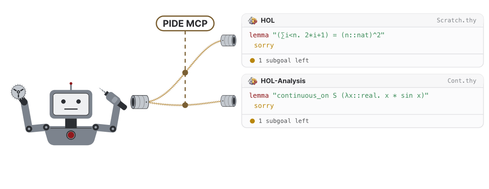

# Isabelle PIDE MCP Server

**Agentic formal proof development with Isabelle: [formalproof.ai](https://formalproof.ai)**

This repository contains:
1. A Model Context Protocol (MCP) server to **let AI agents interactively work with Isabelle** sessions, theories, and ML files via Isabelle/PIDE.
   The MCP server is **headless** and **editor-agnostic**: you can let the agent work on its own or run it alongside Isabelle/jEdit or Isabelle/VSCode.
   The MCP server is also **customizable** and **extensible**: you can freely add and remove MCP tools offered to the agents.
1. A curated set of MCP tools for typical Isabelle workflows (auto-formalization, state inspection, entity lookups, session management, etc.).
1. A set of agent skills on how to effectively use the MCP and provided tools and general guidance for formalization tasks and Isabelle.

**Find the preprint here: [](https://doi.org/10.5281/zenodo.21519364)**

**Hint:** If you have trouble installing, configuring, or running this project, 
ask your coding agent for help and point it to this README.

<picture>
  <source media="(prefers-color-scheme: dark)" srcset="./docs/pide_mcp_scene_dark.gif">
  <source media="(prefers-color-scheme: light)" srcset="./docs/pide_mcp_scene.gif">
  
</picture>

## Supported Isabelle Versions

PIDE MCP releases are aligned with Isabelle releases.

- Every supported Isabelle release has a branch of this repository named after it (e.g. `Isabelle2025-2`). Use the branch matching your Isabelle release.
- Use branch `main` for the PIDE MCP's development version, which possibly requires a development version of Isabelle, documented in [ISABELLE\_VERSION](./ISABELLE_VERSION).

## Usage Notes

To get started (see details below), you install the MCP server, register it to a coding agent, and then you can start prompting.
To interactively explore the agent's changes, you may also run an Isabelle/jEdit or Isabelle/VSCode session next to the coding agent that uses the MCP server (cf. screenshot).


**Take note of the following when using the MCP server:**
- The server manages its own PIDE sessions. In particular, this means that **your editor's session and the MCP server's sessions are independent of each other**.
  For example, commands will be processed by the MCP server's sessions AND the editor's session,
  and Isabelle options passed to the editor session (e.g. base session and included session directories) also have to be passed to the MCP server.
- **If you edit the same files as the MCP server, it will only see your changes once they are written to disk.**
  The provided MCP tools automatically synchronize with disk on every read and write.
  Vice versa, **if a file is edited via the MCP server, you may need to manually reload the file in your editor** in case the editor does not auto-reload on disk changes.
  In Isabelle/jEdit, it is sometimes necessary to reload manually (e.g. by using the F5 key). Isabelle/VSCode supports auto-reload. 
  Avoid editing a file while the agent works on it. You might have to merge conflicts by hand otherwise.
- If you want the agent to see proof states in pre-built base sessions, you have to build them with `-o show_states`.

## Installing the MCP Server

1. Install the supported Isabelle version. The supported version is stored in [ISABELLE\_VERSION](./ISABELLE_VERSION). Newer versions may also work (without guarantee). If you use a version compatible with an Isabelle release, [download it](https://isabelle.in.tum.de/). If you use a development version, insert the version number into the command below:
```bash
hg clone https://isabelle.in.tum.de/repos/isabelle
isabelle/Admin/init -r <VERSION_NUMBER>
```
   **Note for  macOS users:** on first start, macOS may block Isabelle. Open it, cancel the security dialog, then allow it in *System Settings → Privacy & Security* ("Allow Apps..."). See the [Isabelle installation notes](https://isabelle.in.tum.de/installation.html).
2. Clone and navigate into this repository. Then check out the branch matching your Isabelle version, as explained further above:
```bash
git clone <THIS_REPOSITORY>
cd isabelle-pide-mcp
git checkout <BRANCH>
```
   **Note for Windows users:** make sure that `etc/settings` uses `LF` line breaks.
3. Register this project as an Isabelle component by inserting the file path to this project into the command below.
```bash
isabelle/bin/isabelle components -u <PATH_TO_THIS_DIRECTORY>
```
   Note that this registers the component by path. If you move this directory later, you hence have to amend the registration.

## Running the MCP Server

**Note for Windows users:** You have to run below commands through Isabelle's cygwin (`isabelle/contrib/cygwin/bin/bash.exe`).

You can start a PIDE MCP server manually, either without any session
```bash
isabelle/bin/isabelle pide_mcp
```
or with one or more sessions started automatically (use `-S` if using more than one session):
```bash
# start one HOL-based session
isabelle/bin/isabelle pide_mcp -l HOL
# start one HOL-based, one Pure-based, and one HOL-Analysis-based session
isabelle/bin/isabelle pide_mcp -l HOL -S "-l Pure" -S "-l HOL-Analysis"
```
As usual, all options are displayed using `pide_mcp -?`.
If everything is set up correctly, PIDE MCP will be built automatically
and report its successful start.

Very likely, you want to register the server to your MCP client (e.g. OpenCode, Claude Code, Codex,...):

## Connecting Coding Agents to the MCP Server

You have to set up two things for your coding agent: 
1. the **MCP configuration**, which tell the agent how to start PIDE MCP, and
2. the **agent skills**, which tell the agent how to use PIDE MCP and Isabelle.

**Note:** many files and folders mentioned below start with a dot (`.mcp.json`, `.opencode`,...).
Such files are often hidden by default in most file explorers and shells.

Most coding agents support global and local configurations:
- *Global configurations* apply every time you start the coding agent.
- *Local configurations* (typically) override global ones and only apply when you start the agent in the folder containing the local configuration.

We recommend the following:
1. A global configuration of PIDE MCP and its skills, without automatic session startups. This way, a light-weight PIDE MCP server starts with every coding agent. The agent has the option to start Isabelle sessions on demand/instruction.
2. A local MCP configuration whenever a project should automatically start a set of sessions or include a special set of project options.

### Global Configuration

Copy the MCP entry of this repository's MCP configuration into your coding agent's global configuration file 
and the agent skills into its global skills folder. 
When doing so, **drop all session options (e.g. `-l HOL`)** so that the server starts without a session and 
**adjust the path to Isabelle** in the MCP configuration.

- For **OpenCode**, copy the `mcp` entry of `.opencode/opencode.json` into
  `~/.config/opencode/opencode.json` and the folders in `.opencode/skills` into `~/.config/opencode/skills`.
- For **Claude Code**, copy the `mcpServers` entry of `.mcp.json` into `~/.claude.json` and the folders
  in `.claude/skills` into `~/.claude/skills`.
- For **Codex**, copy the `mcp_servers` entry of `.codex/config.toml` into `~/.codex/config.toml` and
  the folders in `.agents/skills` into `~/.agents/skills`.

**Note for Windows users:** You may have to adapt the paths accordingly. 
Consult your coding agent's documentation for its configuration and skill locations on Windows.

### Local Configuration

Copy the configuration folders and files of this repository into your project.
You have to **adjust the path to Isabelle** and possibly the options you want to pass to the MCP server (e.g. base sessions and included session directories).
Optionally remove the `skills` folder if you have already configured them globally.

- For **OpenCode**, copy/adjust `.opencode` and start OpenCode in the same directory.
- For **Claude Code**, copy/adjust `.claude` and `.mcp.json` and start Claude Code in the same directory.
- For **Codex**, copy/adjust `.agents` and `.codex` and start Codex in the same directory.

### Checking the Configuration

Start your coding agent and let it list its MCP servers,
e.g. using `/mcp` in OpenCode, Claude Code, and Codex.
PIDE MCP should be listed as connected.
If it is not, ask your agent for help
or consult your coding agent's documentation on how to inspect its MCP server logs.
Similarly, use `/skills` to check if this repository's agent skills are found.

### Note for Windows Users 

**Your coding agent has to open Isabelle via cygwin**. 
For example, in Claude Code, you can use the following MCP configuration (with adjusted paths and options):
```
      "command": "C:\\Users\\kevin\\isabelle\\contrib\\cygwin\\bin\\bash.exe",
      "args": ["--login", "-c", "\"C:/Users/kevin/isabelle/bin/isabelle\" pide_mcp -l HOL"]
```

### Agent Skills

The `skills` folders (identical copies in `.agents/`, `.claude/`, and `.opencode/`) contain the following guidance for AI agents.
- `isabelle-formalization`: Guidance and best practices for formalization.
- `isabelle-proof-development`: Guidance on proof search, automation, and concept search.
- `pide-mcp`: Guidance on using the provided MCP tools effectively.

You may adjust these guidances as you wish.

### Start Prompting

You can now start prompting your coding agent.
Remember that you can run Isabelle's editors (Isabelle/jEdit, Isabelle/VSCode)
on the same files at the same time (cf. screenshot above),
keeping the synchronization caveats from the [Usage Notes](#usage-notes) section in mind.

## Customizing the MCP Server's Tools

Tools that should be offered by the server must extend `PIDE_MCP_Tools`, be registered via the `services` field in `build.props`, and be enabled in the Isabelle option `pide_mcp_tools`.
- Disable tools at compilation time by removing them from `services` in `build.props` or exclude them at startup using the Isabelle option `pide_mcp_tools` (see [`etc/options`](./etc/options)).
- Add tools by adding the relevant source files to `sources` and the relevant class to `services` in `build.props` and include them in the Isabelle option `pide_mcp_tools`.
- Restart the MCP server after editing the services or option.

You can either use the PIDE MCP's `build.props` (modify [`etc/build.props`](./etc/build.props))
or use a different Scala component:
1. Create a Scala component.
1. Add `env:ISABELLE_PIDE_MCP_JAR` to the component's `requirements` in `build.props`.
1. Add your tools' `sources` and `services`.
1. Register the component: `isabelle components -u <PATH_TO_THE_COMPONENT>`.
1. Add the tool to the Isabelle option `pide_mcp_tools`

## Known Limitations/Future Work

- Command timings for pre-built sessions are currently returned as 0.
- Node sources of base session blobs should be loaded from database. They are currently read from disk.
- It would be desirable to have the option to share a PIDE session among the MCP server and editors (Isabelle/jEdit, Isabelle/VSCode).
  This requires changes in the Isabelle distribution sources.
- It would be desirable to explore changes with PIDE without altering the affected document's state, 
  cf. this [email by Hanno Becker](https://isabelle.zulipchat.com/#narrow/channel/247541-Mirror.3A-Isabelle-Users-Mailing-List/topic/.5Bisabelle.5D.20Isabelle.2FREPL/near/581059372).
  This requires changes in the Isabelle distribution sources.

## Related Work

[I/Q](https://github.com/awslabs/AutoCorrode/tree/main/iq) is an alternative Isabelle MCP server that provides an Isabelle/jEdit-centred workflow (using a shared document state).
Experience reports using both systems are very welcome: we hope that the strengths of both MCP servers can be combined in the future.

## Feedback, Questions, Discussions

Please use [this Isabelle Zulip stream](https://isabelle.zulipchat.com/#narrow/channel/202967-New-Members-.26-Projects/topic/PIDE.20MCP).
Alternatively, contact Kevin Kappelmann by email.

## Acknowledgments

We thank Maximilian Schäffeler, Lukas Stevens, Mohammad Abdulaziz, Andrei Popescu, Dmitriy Traytel, Tobias Nipkow, Yong Kiam Tan, and Diego Marmsoler
for their helpful feedback and testing.

## Citation

Cite the preprint: 
[](https://doi.org/10.5281/zenodo.21519364)
```
@misc{pide_mcp,
  author     = {Kappelmann, Kevin},
  title      = {{PIDE MCP}: Connecting {AI} Agents to {Isabelle}},
  year       = 2026,
  publisher  = {Zenodo},
  doi        = {10.5281/zenodo.21519364},
  url        = {https://doi.org/10.5281/zenodo.21519364}
}
```

Cite this release (PIDE MCP `2025-2`): 
[](https://doi.org/10.5281/zenodo.21298851)
```
@software{pide_mcp_code_release,
  author     = {Kappelmann, Kevin},
  title      = {{Isabelle PIDE MCP}},
  license    = {LGPL-3.0},
  year       = 2026,
  publisher  = {Zenodo},
  version    = {2025-2},
  doi        = {10.5281/zenodo.21298851},
  url        = {https://doi.org/10.5281/zenodo.21298851}
}
```

Cite this repository:
```
@software{pide_mcp_code,
  author  = {Kappelmann, Kevin},
  title   = {{Isabelle PIDE MCP}},
  license = {LGPL-3.0},
  year    = {2026},
  url     = {https://github.com/kappelmann/isabelle-pide-mcp}
}
```

