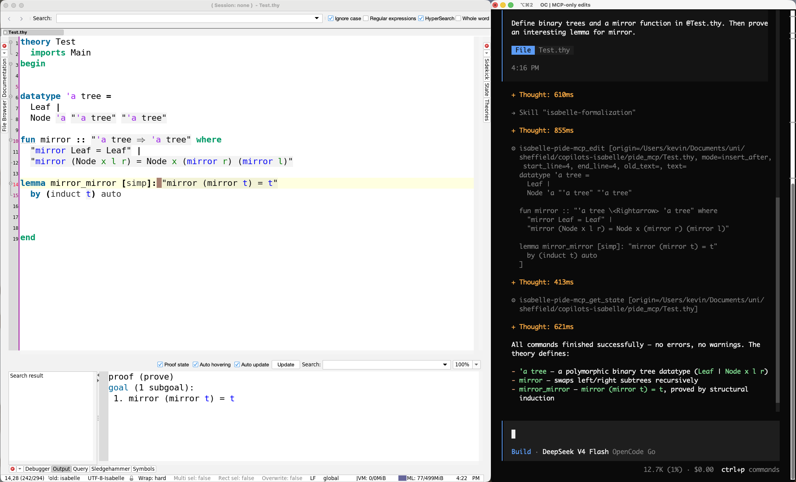

# Isabelle PIDE MCP Server

This repository contains:
1. A Model Context Protocol (MCP) server to **let AI agents interactively work with Isabelle** theories and ML files via an Isabelle/PIDE session.
   The MCP server is **headless** and **editor-agnostic**: you can let the agent work on its own or run it alongside Isabelle/jEdit or Isabelle/VSCode.
   The MCP server is also **customizable** and **extensible**: you can freely add and remove MCP tools offered to the agents.
2. A curated set of MCP tools for typical Isabelle workflows (auto-formalization, state inspection, entity lookups, etc.).
3. A set of agent skills on how to effectively use the MCP and provided tools and general guidance for formalization tasks and Isabelle.

**Find the preprint here: [](https://doi.org/10.5281/zenodo.21519364)**

## Supported Isabelle Versions

PIDE MCP releases are aligned with Isabelle releases.

- The latest supported Isabelle release is `Isabelle2025-2`. Use branch `2025-2` of this repository for this version.
- Use branch `main` for the PIDE MCP's development version, which possibly requires a development version of Isabelle, documented in [ISABELLE\_VERSION](./ISABELLE_VERSION).

## Usage Notes

To get started (see details below), you install the MCP server, register it to a coding agent, and then you can start prompting.
To interactively explore the agent's changes, you may also run an Isabelle/jEdit or Isabelle/VSCode session next to the coding agent that uses the MCP server (cf. screenshot).



**Take note of the following when using the MCP server:**
- The server manages its own PIDE session. In particular, this means that your editor's session and the MCP server's session are independent of each other.
  For example, commands will be processed by the MCP server's session AND the editor's session,
  and Isabelle options passed to the editor session (e.g. included session directories) also have to be passed to the MCP server.
- If you edit the same files as the MCP server, it will only see your changes once they are written to disk.
  The provided MCP tools automatically synchronize with disk on every read and write.
  Vice versa, if a file is edited via the MCP server, you may need to manually reload the file in your editor in case the editor does not auto-reload on disk changes.
  In Isabelle/jEdit, it is sometimes necessary to reload manually (e.g. by using the F5 key). Isabelle/VSCode supports auto-reload. 
- If you want the agent to see proof states in pre-built base sessions, you have to build them with `-o show_states`.

## Installing the MCP Server

1. Install the supported Isabelle version. The supported version is stored in [ISABELLE\_VERSION](./ISABELLE_VERSION). Newer versions may also work (without guarantee). If you use a version compatible with an Isabelle release, [download it](https://isabelle.in.tum.de/). If you use a development version, insert the version number into the command below:
```bash
hg clone https://isabelle.in.tum.de/repos/isabelle
isabelle/Admin/init -r <VERSION_NUMBER>
```
2. Install the component. Insert the file path to this directory into the command below:
```bash
isabelle/bin/isabelle components -u <PATH_TO_THIS_DIRECTORY>
```

## Running the MCP Server

You can register the server to your MCP client (e.g., OpenCode, Claude Code, Codex,...) or start the server manually:

```bash
isabelle/bin/isabelle pide_mcp -l HOL
```

As usual, all options are displayed using `pide_mcp -?` (they follow the typical Isabelle conventions, e.g. `-d`, `-v`, `-L`).

### Connecting Coding Agents to the MCP Server

- For **OpenCode**, copy/adjust folder `.opencode` and start OpenCode in the same base directory.
  - **You have to adjust the path to isabelle in `.opencode/opencode.json`** and possibly the options you want to pass to the MCP server (e.g. included session directories).
- For **Claude Code**, copy/adjust `.claude` and `.mcp.json` and start Claude Code in the same base directory. 
  - **You have to adjust the path to isabelle in `.mcp.json`** and possibly the options you want to pass to the MCP server (e.g. included session directories).

## Customizing the MCP Server's Tools

Tools that should be offered by the server must extend `PIDE_MCP_Tools` and be registered via the `services` field in `build.props`.
- Disable tools by removing them from `services`.
- Add tools by adding the relevant source files to `sources` and the relevant class to `services`.
- Restart the MCP server after editing the services.

You can either use the PIDE MCP's `build.props` (modify [`etc/build.props`](./etc/build.props))
or use a different Scala component:
1. Create a Scala component.
1. Add `env:ISABELLE_PIDE_MCP_JAR` to the component's `requirements` in `build.props`.
1. Add your tools' `sources` and `services`.
1. Register the component: `isabelle components -u <PATH_TO_THE_COMPONENT>`.

## Agent Skills

The `skills` folders (in `.opencode/` and `.claude/`) contain the following guidance for AI agents:
- `isabelle-formalization`: Guidance and best practices for formalization.
- `isabelle-proof-development`: Guidance on proof search, automation, and concept search.
- `pide-mcp`: Guidance on using the provided MCP tools effectively.

You may adjust these guidances as you wish.

## Known Limitations/Future Work

- Command timings for pre-built sessions are currently returned as 0.
- It would be desirable to have the option to share a PIDE session among the MCP server and editors (Isabelle/jEdit, Isabelle/VSCode).
  This requires changes in the Isabelle distribution sources.
- It would be desirable to explore changes with PIDE without altering the affected document's state, 
  cf. this [email by Hanno Becker](https://isabelle.zulipchat.com/#narrow/channel/247541-Mirror.3A-Isabelle-Users-Mailing-List/topic/.5Bisabelle.5D.20Isabelle.2FREPL/near/581059372).
  This requires changes in the Isabelle distribution sources.

## Related Work

[I/Q](https://github.com/awslabs/AutoCorrode/tree/main/iq) is an alternative Isabelle MCP server that provides an Isabelle/jEdit-centred workflow (using a shared document state).
Experience reports using both systems are very welcome: we hope that the strengths of both MCP servers can be combined in the future.

## Feedback, Questions, Discussions

Please use [this Isabelle Zulip stream](https://isabelle.zulipchat.com/#narrow/channel/202967-New-Members-.26-Projects/topic/PIDE.20MCP).
Alternatively, contact Kevin Kappelmann by email.

## Acknowledgments

We thank Maximilian Schäffeler, Lukas Stevens, Mohammad Abdulaziz, Andrei Popescu, Dmitriy Traytel, and Tobias Nipkow 
for their helpful feedback and testing.

## Citation

Cite the preprint: 
[](https://doi.org/10.5281/zenodo.21519364)
```
@misc{pide_mcp,
  author     = {Kappelmann, Kevin},
  title      = {{PIDE MCP}: Connecting {AI} Agents to {Isabelle}},
  year       = 2026,
  publisher  = {Zenodo},
  doi        = {10.5281/zenodo.21519364},
  url        = {https://doi.org/10.5281/zenodo.21519364}
}
```

Cite this release (PIDE MCP `2025-2`): 
[](https://doi.org/10.5281/zenodo.21298851)
```
@software{pide_mcp_code_release,
  author     = {Kappelmann, Kevin},
  title      = {{Isabelle PIDE MCP}},
  license    = {LGPL-3.0},
  year       = 2026,
  publisher  = {Zenodo},
  version    = {2025-2},
  doi        = {10.5281/zenodo.21298851},
  url        = {https://doi.org/10.5281/zenodo.21298851}
}
```

Cite this repository:
```
@software{pide_mcp_code,
  author  = {Kappelmann, Kevin},
  title   = {{Isabelle PIDE MCP}},
  license = {LGPL-3.0},
  year    = {2026},
  url     = {https://github.com/kappelmann/isabelle-pide-mcp}
}
```

